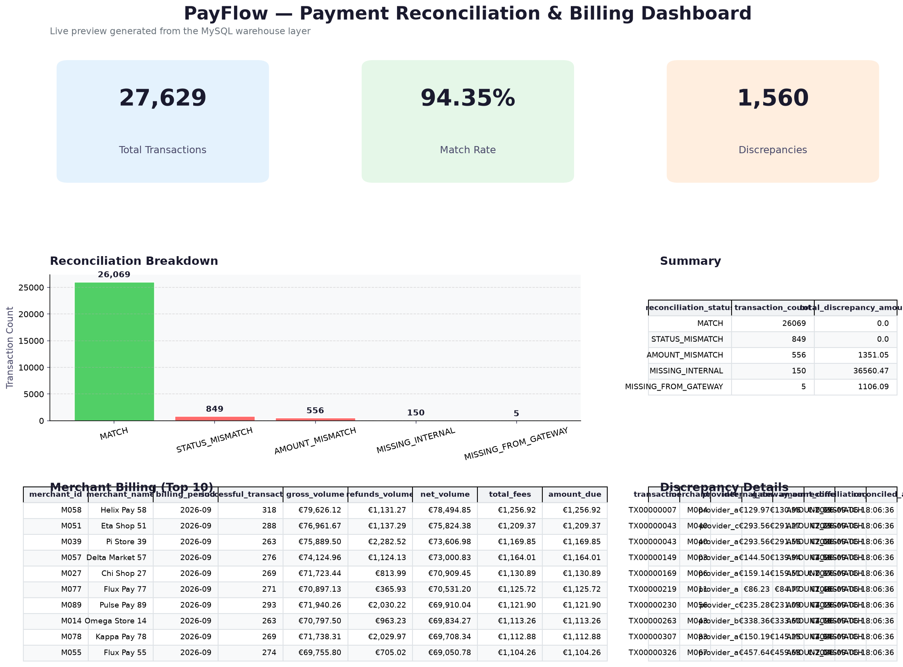

# PayFlow — Automated Payment Reconciliation & Billing Data Platform

[](https://github.com/DenitsaNes/payflow-data-platform/actions/workflows/ci.yml)


> **A production-inspired data engineering platform that ingests heterogeneous payment data, reconciles it against internal records, detects data-quality issues, and produces merchant billing analytics.**

---

## 📌 Table of Contents

1. [Why PayFlow?](#why-payflow)
2. [The Business Problem](#the-business-problem)
3. [Architecture](#architecture)
4. [Tech Stack & Rationale](#tech-stack--rationale)
5. [Data Sources](#data-sources)
6. [Reconciliation Logic](#reconciliation-logic)
7. [Data Warehouse](#data-warehouse)
8. [Data Quality](#data-quality)
9. [Dashboard](#dashboard)
10. [Quick Start](#quick-start)
11. [Lessons Learned](#lessons-learned)
12. [Future Enhancements](#future-enhancements)
13. [Contact](#contact)
14. [License](#license)

---

## Why PayFlow?

PayFlow is a fictional European fintech that receives transaction files from multiple payment gateways. Finance currently compares these files manually against internal systems — a **4-hour, error-prone process**.

This project simulates a real client engagement and demonstrates how a Junior Data Engineer would:

- Translate a business problem into a data pipeline.
- Model data for both operational and analytical workloads.
- Build automated reconciliation and financial reporting.
- Enforce data quality and test-driven development.
- Deliver a reproducible, CI/CD-backed solution.

> **Impact:** PayFlow automates a daily 4-hour reconciliation process, flags discrepancies automatically, and produces billing reports that previously required manual spreadsheet work.

---

## The Business Problem

> *“We receive transaction files from three payment providers every day. Finance manually compares them against our internal system. This takes ~4 hours and errors are hard to spot.”*

PayFlow needs:

1. **Automated ingestion** of heterogeneous provider data (CSV, JSON, API).
2. **Standardization** of different schemas into one canonical model.
3. **Reconciliation** between internal transactions and gateway-reported transactions.
4. **Duplicate detection** and malformed-record handling.
5. **Merchant billing calculations** with fee logic.
6. **Historical analytics** via a star-schema data warehouse.
7. **Operational dashboard** for finance and operations teams.

---

## Architecture

```text
  data/generated/raw/
  ├── provider_a/*.csv
  ├── provider_b/*.json
  └── provider_c/*.csv
           |
           ▼
  ┌─────────────────────┐
  │   Bronze Layer      │  raw_record JSON + file metadata
  │                     │  bronze_raw_provider_files
  │                     │  bronze_provider_transactions
  └─────────────────────┘
           |
           ▼
  ┌─────────────────────┐
  │   Silver Layer      │  cleaned, validated, deduplicated
  │                     │  silver_transactions
  │                     │  silver_rejected_transactions (quarantine)
  └─────────────────────┘
           |
           ▼
  ┌─────────────────────┐
  │   Gold Layer        │  star-schema warehouse + reconciliation
  │                     │  warehouse_fact_transaction
  │                     │  warehouse_v_reconciliation_summary
  │                     │  warehouse_billing_summary
  └─────────────────────┘
           |
           ▼
        BI Dashboard
```

### Data Layers

| Layer | Purpose | Key Tables/Files |
|-------|---------|------------------|
| **Bronze** | Raw provider files exactly as received, with metadata and original JSON. | `bronze_raw_provider_files`, `bronze_provider_transactions`, `data/generated/raw/` |
| **Silver** | Canonical, cleaned, validated, deduplicated transactions plus a quarantine table. | `silver_transactions`, `silver_rejected_transactions` |
| **Gold** | Business-ready fact/dimension tables, reconciliation, and billing. | `warehouse_fact_transaction`, `warehouse_v_reconciliation_summary`, `warehouse_billing_summary` |

The pipeline is **idempotent**: a `pipeline_processed_files` log and `ON DUPLICATE KEY UPDATE` upserts make reruns safe.

---

## Tech Stack & Rationale

| Area | Tools | Why |
|------|-------|-----|
| **Languages** | SQL, Python | Core data engineering languages. |
| **Database** | MySQL 8.0 | Widely used in mid-market companies; good practice for schema design and stored procedures. |
| **Cloud (designed)** | AWS S3, Lambda, Glue, Kinesis | Event-driven ingestion, batch processing, and streaming in one architecture. |
| **Processing** | Python, pandas, PySpark | pandas for local ETL; PySpark designed for scale. |
| **Data Quality** | Custom validators + dbt tests | Lightweight but extensible; easy to swap for Great Expectations later. |
| **Transformation** | dbt | Industry-standard analytics engineering tool; tests and documentation out of the box. |
| **Orchestration** | Apache Airflow (designed) | Planned for scheduling and monitoring. |
| **Dashboard** | Streamlit | Quick, Python-native dashboard for portfolio demos. |
| **Testing** | pytest, GitHub Actions | Automated tests on every commit. |
| **Docs** | Markdown ADRs, business requirements, lesson plans | Consulting-style documentation. |

---

## Data Sources

Three external providers send data in different structures.

### Provider A — CSV

```csv
transaction_id,merchant_id,amount,currency,status,timestamp
TX001,M001,125.50,EUR,COMPLETED,2026-09-06 10:32:11
```

### Provider B — JSON

```json
{
  "payment_id": "TX001",
  "merchant": "M001",
  "value": 125.50,
  "currency": "EUR",
  "payment_status": "SUCCESS",
  "created_at": "2026-09-06T10:32:11Z"
}
```

### Provider C — CSV with different names

```csv
transactionId,merchant,amount,currency,result,date
```

### Canonical Target Schema

```text
transaction_id
transaction_timestamp
source_system       -- internal / provider_a / provider_b / provider_c
provider            -- provider literal (NULL for internal)
merchant_id
amount
currency
status
source_file
batch_id
loaded_at
```

---

## Reconciliation Logic

The centerpiece of the project is SQL-based reconciliation between internal transactions and gateway-reported transactions.

| Transaction | Internal | Gateway | Result |
|-------------|----------|---------|--------|
| TX001 | €100 | €100 | `MATCH` |
| TX002 | €250 | €250 | `MATCH` |
| TX003 | €120 | €125 | `AMOUNT_MISMATCH` |
| TX004 | €80 | — | `MISSING_FROM_GATEWAY` |
| TX005 | — | €90 | `MISSING_INTERNAL` |
| TX006 | SUCCESS | FAILED | `STATUS_MISMATCH` |

See [`sql/reconciliation/reconcile_transactions.sql`](sql/reconciliation/reconcile_transactions.sql) for the CTE-driven implementation.

---

## Data Warehouse

Star schema for analytics:

```text
                       dim_date
                          |
                          ▼
dim_merchant ───── fact_transaction ───── dim_provider
                          |
                          ▼
                     dim_currency

                          |
                          ▼
                   fact_reconciliation
                          |
                          ▼
                    fact_billing
```

### Fact Tables

- `fact_transaction`
- `fact_reconciliation`
- `fact_billing`

### Dimension Tables

- `dim_merchant`
- `dim_provider`
- `dim_currency`
- `dim_date`
- `dim_transaction_status`

---

## Data Quality

Incoming Bronze records are cleaned and validated in the Silver layer. The first failing rule wins so each rejected record has a clear reason:

- `missing_transaction_id`
- `missing_merchant_id`
- `invalid_amount`
- `negative_amount`
- `invalid_currency`
- `invalid_timestamp`
- `future_timestamp`
- `invalid_status`
- `unknown_merchant`

Valid records are deduplicated by `(transaction_id, provider)` and upserted into `silver_transactions`. Invalid records are written to `silver_rejected_transactions` with the raw JSON and rejection reason for investigation.

Sample rejection breakdown after a pipeline run:

```text
invalid_currency       164
future_timestamp       148
invalid_status         143
negative_amount        139
unknown_merchant       137
invalid_timestamp      133
missing_transaction_id 127
missing_merchant_id    126
```

---

## Dashboard

A Streamlit dashboard connects to the warehouse and shows:

- Executive KPIs (total transactions, match rate, discrepancies)
- Reconciliation breakdown chart
- Merchant billing table
- Filterable discrepancy details



Run it locally:

```bash
streamlit run src/dashboard/dashboard.py
```

---

## Quick Start

### 1. Start MySQL

```bash
docker compose up -d
```

MySQL is exposed on host port `3307` to avoid conflicts with any native MySQL install.

### 2. Create schema

```bash
mysql -h 127.0.0.1 -P 3307 -u payflow -p payflow < sql/schema/01_create_database.sql
```

Password: `payflow`

### 3. Install Python dependencies

```bash
python -m venv .venv
source .venv/bin/activate
pip install -r requirements.txt
```

### 4. Generate the 10k dataset

```bash
python src/utils/generate_data.py
```

This creates realistic provider files and internal transactions under `data/generated/raw/`.

### 5. Seed reference data

```bash
mysql -h 127.0.0.1 -P 3307 -u payflow -p payflow < data/generated/seed_data.sql
```

### 6. Run the end-to-end pipeline

```bash
python run_pipeline.py --source data/generated/raw
```

The pipeline runs Bronze loading, Silver cleaning/validation/dedup, fact loading, reconciliation, and billing. Rerunning is safe thanks to the idempotency log.

### 7. Run dbt

```bash
cd payflow_dbt
dbt run
dbt test
```

### 8. Run tests

```bash
pytest tests/ -v
```

---

## SQL Analytics Examples

Portfolio-ready query examples live in [`sql/queries/`](sql/queries/):

- [`daily_volume_trend.sql`](sql/queries/daily_volume_trend.sql) — running totals and 7-day moving averages
- [`top_merchants_by_volume.sql`](sql/queries/top_merchants_by_volume.sql) — ranked merchant volume
- [`provider_reliability.sql`](sql/queries/provider_reliability.sql) — match/mismatch rates per provider
- [`late_arrival_analysis.sql`](sql/queries/late_arrival_analysis.sql) — gap between internal and gateway timestamps
- [`duplicate_detection.sql`](sql/queries/duplicate_detection.sql) — duplicate records before deduplication
- [`rejected_records_breakdown.sql`](sql/queries/rejected_records_breakdown.sql) — quarantine reasons by provider

An index-optimization demonstration is in [`sql/indexes/index_optimization.sql`](sql/indexes/index_optimization.sql).

---

## Performance

PayFlow is tested locally on a 2026 MacBook Pro (Apple Silicon) with Docker MySQL 8.0. The pipeline comfortably handles **100,000 internal transactions**, which expand to ~280,000 raw provider records across three gateways.

Run it yourself:

```bash
python scripts/run_scale_test.py --num-transactions 100000
```

Representative results:

| Stage | Time | Notes |
|-------|------|-------|
| Reset schema | 0.27s | `sql/schema/01_create_database.sql` |
| Generate data | 2.45s | 100k internal + 100 merchants + ~280k provider rows |
| Load seed | 1.03s | Reference merchants, dimensions, statuses |
| Bronze load | 15.32s | Parse CSV/JSON and land raw records |
| Silver clean | 18.19s | Validate, reject, dedupe, upsert |
| Fact load | 3.01s | Populate `warehouse_fact_transaction` |
| Reconciliation | 3.55s | Compare internal vs gateway records |
| Billing | 0.23s | Compute merchant fees and amount due |
| **Total** | **~44 s** | End-to-end on a single local container |

Silver output for the 100k run:

```text
Valid records upserted: 265,758
Rejected records:       11,088
```

The bottleneck is the pandas-based Silver cleaner. For a real production deployment this stage would move to a distributed engine (Spark, dbt + warehouse, or Airflow-managed chunks).

---

## Lessons Learned

1. **MySQL CTE syntax differs from PostgreSQL.** Reconciliation and billing SQL had to be rewritten from `WITH ... INSERT` to `INSERT ... WITH ... SELECT` for MySQL compatibility.
2. **Port mapping matters.** Mapping the Docker MySQL container to host port `3307` prevented collisions with macOS native MySQL and taught me to always isolate dev services.
3. **Tests need import paths.** Adding `tests/conftest.py` to inject the project root into `sys.path` was the cleanest way to make `pytest` resolve the `src` package without a complex install.
4. **Data quality is a feature, not an afterthought.** Building rejected-record handling and validation rules from the start made the pipeline robust against malformed provider files.
5. **Explicit Bronze/Silver layers make debugging easier.** Landing raw records with metadata in Bronze let me trace a rejected Silver record back to the exact provider file and batch.
6. **Idempotency is not optional for production pipelines.** Using a processed-files log and `ON DUPLICATE KEY UPDATE` upserts made reruns safe and predictable.
7. **dbt changes how you think about analytics code.** Separating staging, marts, and tests made the warehouse much easier to explain and maintain.

---

## Future Enhancements

- [ ] **Apache Airflow** — schedule ingestion, reconciliation, and billing daily.
- [ ] **Terraform / AWS SAM** — provision S3, Glue, Kinesis, and RDS MySQL.
- [ ] **Great Expectations** — richer data quality suites and profiling.
- [ ] **Incremental loads** — only process new/changed records in the warehouse.
- [ ] **SCD Type 2** — track historical changes to merchant and provider dimensions.
- [ ] **Streaming ingestion** — consume provider API events via Kinesis.
- [ ] **Cost monitoring** — track pipeline run cost and SLA metrics.

---

## Contact

Built by **Denitsa Nesheva** — aspiring Junior Data Engineer.

- GitHub: [@DenitsaNes](https://github.com/DenitsaNes)
- LinkedIn: *(add your link)*
- Email: *(add your email)*

If you're hiring for a junior data engineering role, I'd love to talk.

---

## License

This project is released under the [MIT License](LICENSE).
